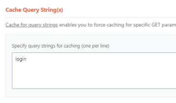

# Unbreakable User Permalink (for User Cache)
<a href="https://github.com/dgnerlab/unbreakable-user-permalink">Unbreakable User Permalink</a> 💪🏻 is a snippet to better handle <a href="https://docs.wp-rocket.me/article/313-user-cache">'User Cache - WP Rocket'</a> using <a href="https://developer.wordpress.org/reference/functions/add_query_arg/">Query string</a>.
This simple snippet was made by a fan of <a href="https://wp-rocket.me/">WP Rocket</a>. But, any plugin that can Cache query string can do the same.

<br />

# Contents
1. <a href="#-what-is-it">What is it?</a>
2. <a href="#-for-example">For example</a>
3. <a href="#-learn-more">Learn more</a>
4. <a href="#-how-to-use">How to use</a>
5. <a href="#-behind">Behind</a>

<br />

# 👀 What is it?
This simple snippet has only three features.
* The Query string '/?login=yes' is added to the login user's Permalink.
* When non-login users access the '/?login=yes' path, they are forcibly redirected to the homepage.
* To avoid operation problems, WordPress 'init' and 'template_redirect' functions have been used appropriately.

Sorry, that's all! 😂 But it can do some pretty fun stuff. <a href="#-for-example">For example →</a>

<br />

# ✨ For example
The problem with the page Cache is that it is difficult to differentiate between logged in and non-logged in users. Because they share the same Permalink, it's hard to physically break them into separate pages. There is a way to utilize Cookie, but it is not simple. Therefore, the <a href="https://github.com/dgnerlab/unbreakable-user-permalink">Unbreakable User Permalink</a> can be divided into separate pages by appending the '/login=yes' query string to the logged in user's Permalink.

Cache plugin must support Query string page Cache.
Here are the benefits:
* Separate pages for logged in users and non-logged users. Therefore, the Cache file is created separately.
* This solves the duplicate Cache issue where logged in users see Cache pages for non-logged in users.
* Cache files of logged in users are well preserved. Avoid unnecessary creation and save server resources.
* This snippet only affects frontend pages. Important files such as robots.txt & sitemap.xml are not affected.
* When using network services like Cloudflare, you can specify page rules for logged in users. (Do without Cookie)
* User Cache can be preloaded using <a href="https://github.com/wp-media/wp-rocket-helpers/tree/master/cache/wp-rocket-cache-common-cache-loggedin">Common Cache for Logged in Users</a> and <a href="https://github.com/wp-media/wp-rocket-helpers/tree/master/cache/wp-rocket-no-cache-for-admins">No Cache for Admin</a>. As a result, the page loading speed is also faster for logged in users. <a href="#-learn-more">Learn more →</a>

<br />

# 📖 Learn more
For logged in users, preloading is almost impossible because cached pages are difficult to preserve. However, if you use the two plugins(Author: WP Rocket Support Team) below with Unbreakable User Permalink, you can also preload the cache of the logged in user.

> Caution! It is only recommended for professionals who can directly verify and test the generated page Cache file.

* <a href="https://github.com/wp-media/wp-rocket-helpers/tree/master/cache/wp-rocket-cache-common-cache-loggedin">Common Cache for Logged in Users</a>
* <a href="https://github.com/wp-media/wp-rocket-helpers/tree/master/cache/wp-rocket-no-cache-for-admins">No Cache for Admin</a>

Common Cache for Logged in Users literally creates only one cache file for the logged in user. So, if someone saves a cache file even once, preloading is realized because other users can equally use that cache file. However, if user A's profile image is stored on a cached page, it may be displayed incorrectly to user B. Therefore, pages with profile images should be excluded from the Cache list. Or, you must have the expertise to only objectify your profile image.

Common Cache for Logged in Users can be used independently, but Permalink remains the same. This can lead to duplicate Cache issues where logged in users can view Cache pages for non-logged in users. So <a href="https://github.com/dgnerlab/unbreakable-user-permalink">Unbreakable User Permalink</a> can properly compensate for this problem.

No Cache for Admin literally prevents admins from accessing Cache pages. This is very important from a security point of view when using a Common Cache for Logged in Users. This is because if done incorrectly, the administrator's screen may be exposed to other users. Therefore, it should be used without exception.

Try it together! However, preloading directly from within WP Rocket is not possible. A non-administrator user must log in and then directly visit the page to create a Cache file. So keep this condition in mind when testing. <a href="#-how-to-use">How to use →</a>

<br />

# 🕹 How to use


Either install the snippet or copy the contents to functions.php in your theme folder, and then make the plugin cache the '?login=yes' query string. Just type in 'login'. The login user's Permalink should be displayed in the following format: https://thisistheway/something/?login=Yes

If the Permalink format is 'https://thisistheway/something?login=yes', the page is accessed normally, but redirects happen along the way. So the snippet needs to be slightly modified. (line 27)

```
return add_query_arg( 'login', 'yes', $permalink );
```
Removed <a href="https://developer.wordpress.org/reference/functions/trailingslashit/">trailingslashit()</a>. This appends a trailing slash. Will remove trailing forward and backslashes if it exists already before adding a trailing forward slash.

Now it's all over. <a href="#-behind">Behind →</a>

<br />

# 🐐 Behind
A simple snippet that would be embarrassing to even call it a plugin is purely for me. But I'm sharing it in case anyone wants a similar feature. Special thanks to <a href="https://rading.kr/">@rading</a> for advice on the order of WordPress functions.
